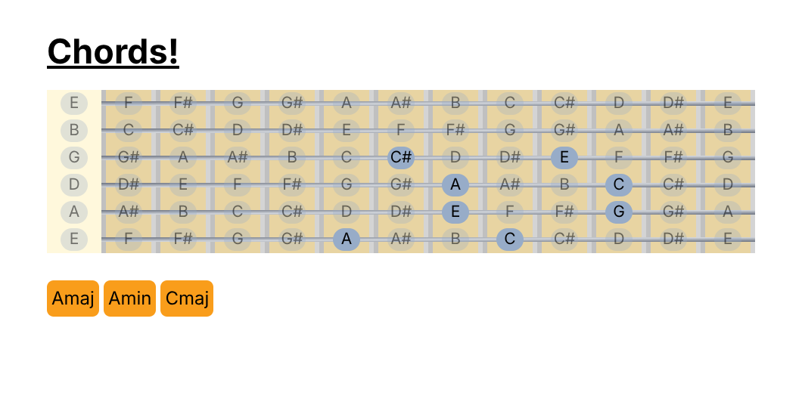

# Fretboard tool
This is a React/Tailwind rewrite of my favourite tool to learn and find chords on the guitar, it has a matching algorithm that narrows note combinations to particular chords.


## Development
You can start the setup with the following commands:
```
# clone the repository:
git clone https://github.com/thearawakan/fretboard_tool.git

# navigate to the cloned directory and install the tools
cd fretboard_tool
npm install .

# run dev environment with bun
bun run dev
```
